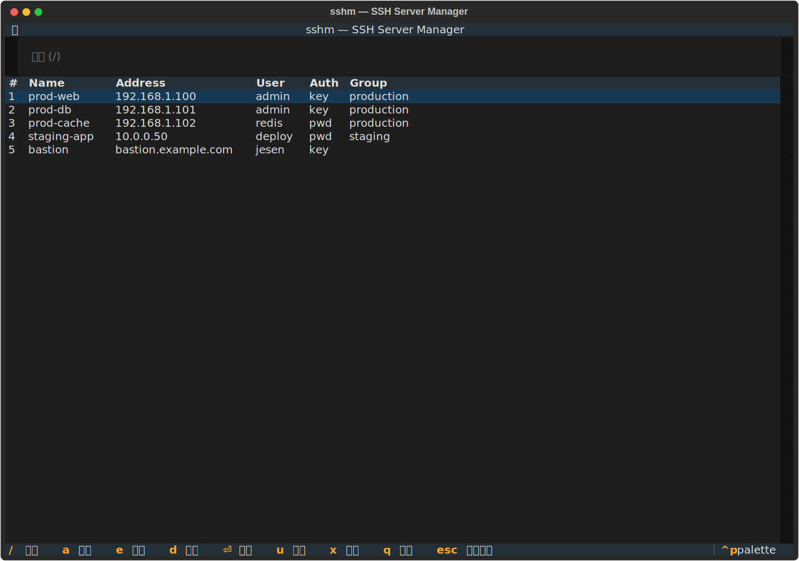

<div align="center">
  <h1>sshm</h1>
  <p><strong>S</strong>SH <strong>S</strong>erver <strong>M</strong>anager for macOS</p>
  <p>加密、可交互的 SSH 服务器管理 CLI —— 为 Mac 终端打造。</p>
  <p>
    
    
    
    
  </p>
</div>

<p align="center">
  
</p>

<p align="center">
  <code>sshm</code> &nbsp;·&nbsp;
  <code>sshm ls</code> &nbsp;·&nbsp;
  <code>sshm connect &lt;server&gt;</code> &nbsp;·&nbsp;
  <code>sshm upload &lt;server&gt; &lt;local&gt; &lt;remote&gt;</code>
</p>

---

## 简介

sshm 是一个 macOS 原生的 SSH 服务器管理 CLI。它面向「管理少量服务器、认证方式混用（密钥 / 密码）、想要类似 Windows 上 WinTerm 的体验、同时要求**凭据加密存储**」的开发者。

### 特性

- **加密保险库** —— 服务器凭据用 AES-256-GCM 加密落盘。
- **交互式 TUI** —— 方向键浏览、搜索、过滤、连接服务器（基于 [Textual](https://github.com/Textualize/textual)）。
- **系统 SSH** —— 直接调用 macOS 自带的 `ssh` / `scp`：完整终端仿真、SSH agent 转发、`~/.ssh/config` 开箱即用。
- **混合认证** —— 每台服务器可选密钥或密码认证。密码认证用 Python 的 `pty`，**无需 sshpass**。
- **会话缓存** —— 首次解锁后，派生的 AES 密钥缓存在 macOS Keychain，后续调用免输主密码。
- **文件传输** —— 通过 SCP 上传 / 下载。

## 快速开始

```bash
# 安装（二选一）
pip install -e .                 # 可编辑安装，提供 sshm 命令
./install.sh                     # 或安装 wrapper 到 /usr/local/bin（用项目 .venv）

# 初始化加密保险库（会提示设置主密码）
sshm init

# 添加第一台服务器
sshm add

# 启动交互式 TUI（首次输入主密码后缓存到 Keychain）
sshm
```

> `sshm` 是 `pyproject.toml` 声明的 console script（入口 `sshm.cli:main`），等效于 `python -m sshm`。

## 环境要求

- macOS（Ventura / Sonoma / Sequoia 均可）
- Python 3.10+
- `ssh` 和 `scp`（macOS 自带）

无需其它外部依赖，**不需要 sshpass**——密码认证用 Python 内置的 `pty` 模块。

## 文档

- [使用指南](docs/usage.md) —— 每个子命令的用法
- [架构与设计](docs/architecture.md) —— 模块划分与关键设计决策
- [贡献指南](CONTRIBUTING.md) —— 开发环境、测试、提交规范
- [更新日志](CHANGELOG.md)
- [安全策略](SECURITY.md) —— 漏洞上报渠道

## 状态

开发中，当前版本 0.1.0。

## 许可证

MIT
